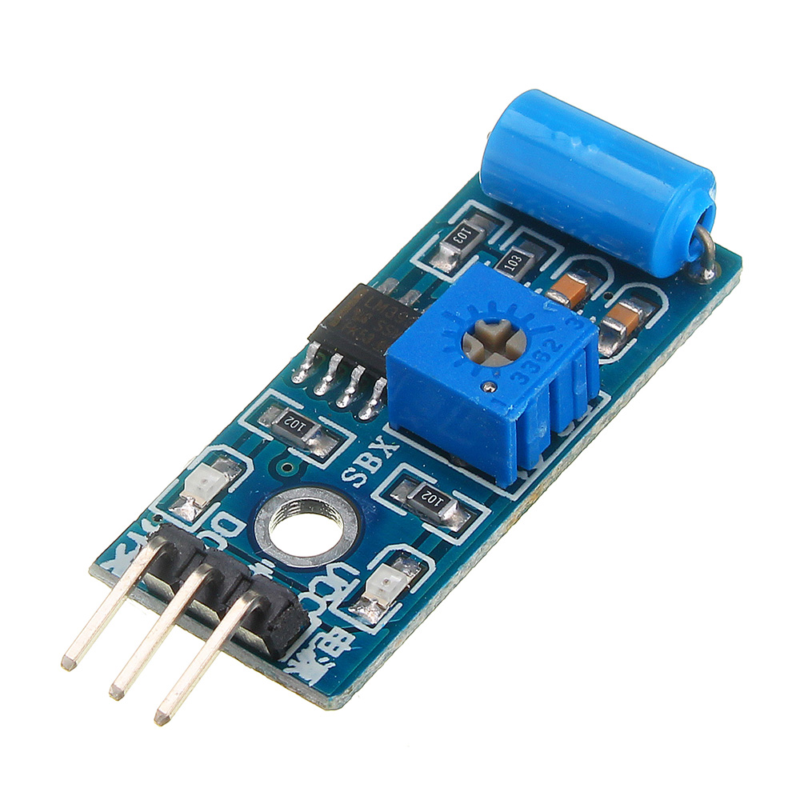
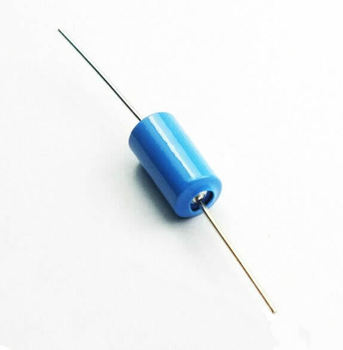
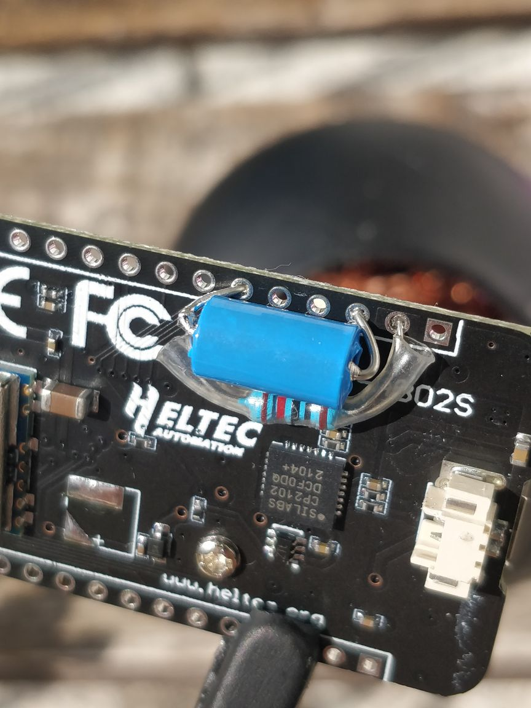

# Overview
**CubeCell-GPS Helium Mapper** based on https://github.com/jas-williams/CubeCell-Helium-Mapper.git with the following improvements:

- No longer stopping the GPS after each SEND, allowing for faster GPS Fix next time.
- Added counters on the JOIN and GPS Fix Wait screens so the user could see how long it takes (could be used to compare antennas, like for example the difference between internal and external GPS antenna is clearly visible, but now you can roughly measure in seconds how much faster you get a fix with one GPS antenna vs another)
- Added Battery Level display on some screens
- Improved movement detection
- Menu mode - short press on the USR button displays a menu, another short press cycles through the options, long press activates the current option
- Screen off mode, activated from the menu - attempt to improve battery life
- Increase/decrease moving update rate from the menu
- Display battery voltage instead of percent by default, option to switch back to percent from the menu 
- Tracker mode, activated from the menu - stores and sends last known location on wake up from sleep. Note - there is new decoder to support that functionality.

This device is used for mapping the Helium networks LoRaWAN coverage. 
The initial settings are - send every 5 seconds while moving, every minute when stopped. 
The Sleep menu option puts the GPS in a sleep mode. The sleep mode decreases the updates to once every 6 hours. 
Pressing the user button while in sleep mode wakes it up and resumes normal operation.

Revision changes:
- Fixed a bug in Tracker mode - after wake up, go to SEND instead of CYCLE
- Removed the randomizaton of the send interval, made MAX_GPS_WAIT optional, fixed issue with the vibration handling
- Tracker mode
- Added option to disable wake up on vibration when sleep was activated from the menu
- Optimized data frame to fit GPS lat/long in 6 bytes instead of 8 and use the new availabe 2 bytes for altitude
- Added option to send data in CayenneLPP format
- Added Menu mode
- Improved movement detection (min stop cycles before switching to stopped update rate). Added battery level display.
- Added vibration sensor wake up. 
- Added Auto Sleep after stopped for too long. 
- Added Auto Sleep when wait for GPS is too long.
- Added Air530Z GPS support for board version 1.1

# Uploading the code

**Note: If you prefer to use Arduino IDE, just take the \src\main.cpp file and rename it to "something".ino (for example CubeCell_GPS_Helium_Mapper.ino)**

- Install Serial Driver
Find Directions [here.](https://heltec-automation-docs.readthedocs.io/en/latest/general/establish_serial_connection.html)

- Install Visual Studio Code
https://code.visualstudio.com/Download

- Install PlatformIO IDE
https://marketplace.visualstudio.com/items?itemName=platformio.platformio-ide


- Clone this repository and open the folder

Edit file main.cpp in folder \src.

Comment out/uncomment the appropriate line for your board version (for GPS Air530 or Air530Z)

Comment out/uncomment the #define lines for VIBR_SENSOR, VIBR_WAKE_FROM_SLEEP, MAX_STOPPED_CYCLES and edit the values for the timers if desired 

Enter DevEUI(msb), AppEUI(msb), and AppKey(msb) from Helium Console, at the respective places in main.cpp. The values must be in MSB format. From console press the expand button to get the ID's as shown below.


```
uint8_t devEui[] = { 0x00, 0x00, 0x00, 0x00, 0x00, 0x00, 0x00, 0x00 };
uint8_t appEui[] = { 0x00, 0x00, 0x00, 0x00, 0x00, 0x00, 0x00, 0x00 };
uint8_t appKey[] = { 0x00, 0x00, 0x00, 0x00, 0x00, 0x00, 0x00, 0x00, 0x00, 0x00, 0x00, 0x00, 0x00, 0x00, 0x00, 0x00 };
```

Modify platformio.ini if you need to change LoRaWAN settings like region.

Click the PlatformIO: Build button

Connect the CubeCell to the computer with USB cable

Click the PlatformIO: Upload button

# Debug using Serial connection via USB

(Optional) Uncomment the line enabling the DEBUG code and build again.
```
//#define DEBUG // Enable/Disable debug output over the serial console
```
Click the PlatformIO: Serial Monitor button

# Setting up Console

In [Helium Console](https://console.helium.com/) create a new function call it Heltec decoder => Type Decoder => Custom Script

Copy and paste the decoder into the custom script pane

```
function Decoder(bytes, port) {
  var decoded = {};
  
  var latitude = ((bytes[0]<<16)>>>0) + ((bytes[1]<<8)>>>0) + bytes[2];
  latitude = (latitude / 16777215.0 * 180) - 90;
  
  var longitude = ((bytes[3]<<16)>>>0) + ((bytes[4]<<8)>>>0) + bytes[5];
  longitude = (longitude / 16777215.0 * 360) - 180;
  
  switch (port)
  {
    case 2:
      decoded.latitude = latitude;
      decoded.longitude = longitude; 
      
      var altValue = ((bytes[6]<<8)>>>0) + bytes[7];
      var sign = bytes[6] & (1 << 7);
      if(sign) decoded.altitude = 0xFFFF0000 | altValue;
      else decoded.altitude = altValue;
      
      decoded.speed = parseFloat((((bytes[8]))/1.609).toFixed(2));
      decoded.battery = parseFloat((bytes[9]/100 + 2).toFixed(2));
      decoded.sats = bytes[10];
      decoded.accuracy = 2.5;
      break;
    case 3:
      decoded.last_latitude = latitude;
      decoded.last_longitude = longitude; 
      break;
  }
     
  return decoded;  
}

```

Create two integrations one for CARGO (optional) and one for MAPPERS.
For CARGO use the available prebuilt integration. 
For MAPPERS use a custom HTTP integration with POST Endpoint URL https://mappers.helium.com/api/v1/ingest/uplink

Go to Flows and from the Nodes menu add your device, decoder function and integrations. 
Connect the device to the decoder. 
Connect the decoder to the integrations.

Useful links:

[Mappers](http://mappers.helium.com) and [Cargo](https://cargo.helium.com)

[Integration information with Mappers](https://docs.helium.com/use-the-network/coverage-mapping/mappers-api/)

[Integration information for Cargo](https://docs.helium.com/use-the-network/console/integrations/cargo/)

# Vibration sensor
Theoretically, any sensor that can provide digital output could be used.

For now, we have information about these 2 options:

- SW-420 board


If you want to use the board, you have to connect it the following way:
```
VCC - VDD
GND - GND
DO  - GPIOx where you pick which one to use, GPIO7 is the closest one on the CubeCell board
```

- SW-420 bare sensor



If you decide to use just the sensor, you connect it between the VDD and 
the GPIO pin you want to use (GPIO5 is most convenient if you want to put the sensor directly on the board).
And you need to add a 10k resistor between GND and the chosen GPIO pin. 

